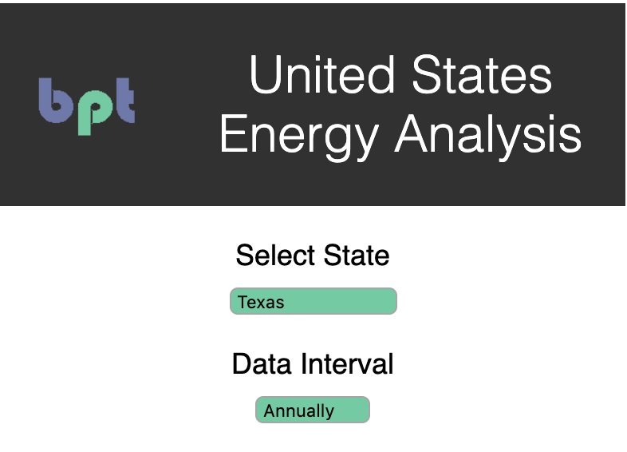

Welcome to our project! This is a collaboration of Kristi Perez (https://github.com/kristiperez/), Umreen Imam (https://github.com/umreen24), Phillip Kennedy (https://github.com/PhilKennedy86), and Bryce Poeter (https://github.com/brycepoeter/). Our objective is to display information from the US Energy Information Administration API in a visually appealing, intuitive, and flexible manner. In essence, this makes energy data stored in JSON accessible to users with no coding experience. 

We have focused on portraying information pertaining to residential electricity usage in the fifty states. This includes the number of residential electricity accounts in each state, their overall usages, the average price per kWh, and other similar categories. This application could easily be adjusted to portray any of the information in the EIA API (https://www.eia.gov/opendata/). 

In creating this app, we have pulled JSON files from the API and displayed the information they contain both graphically and textually. Users are able to click on a state in the interactive map to pull up a state snapshot. These click actions also open the graphs section, which displays changes over time. As such, users can easily click through the map to view not only a snapshot of each state's current situation but also a representation of its past.

You can find our app deployed at http://bpt-energy.surge.sh/ 

The following images are examples of what you will find while using our application:

</img>

 

</img>

 
The next set of images show annual and quarterly graphs when a state is selected:
 
 
</img>

</img>

 
The last set of images are examples of our application on a mobile device with annual and quarterly data:
 
 
</img>
 
</img>
 
</img>
 
 
This project was made jointly by all members of the group with all members contributing to its creation. 
